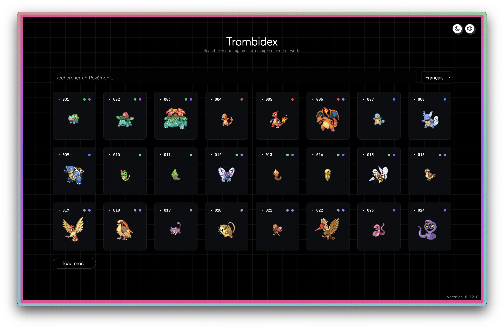

<p align="center">

</p>

<h1 align="center">
Trombidex
</h1>

<p align="center">
A simple pokedex app for experiments.
</p>

## Quickstart

You can test the app at the available URL at the top of this page.

## Screenshots



## Features

* Browse Pokemons list
* Search a Pokemon by name or by id

## Development

* Clone the repo with `git clone https://github.com/rootasjey/trombidex`
* Go to the cloned repo with `cd trombidex`
* Install dependencies with `yarn` or `npm install`
* Run the app with `yarn run start` or `npm start`
* 

-> Setup

Make sure to install the dependencies:

```bash
# yarn
yarn install

# npm
npm install

# pnpm
pnpm install
```

## Development Server

Start the development server on http://localhost:3000

```bash
npm run dev
```

## Production

Build the application for production:

```bash
npm run build
```

Locally preview production build:

```bash
npm run preview
```

## Licence

Mozilla Public License 2.0
